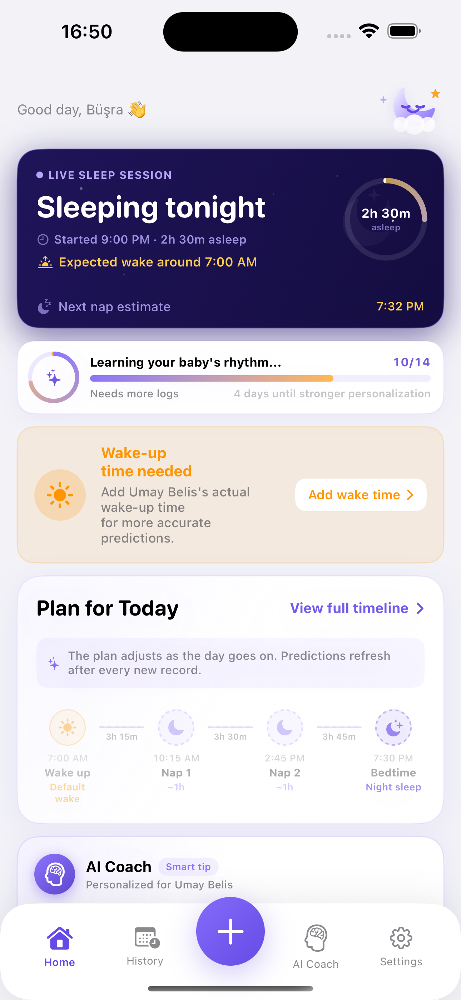
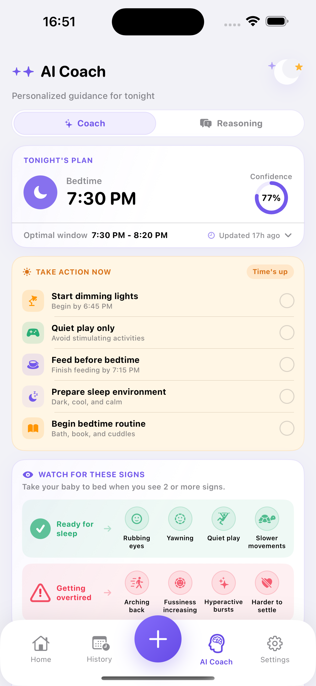
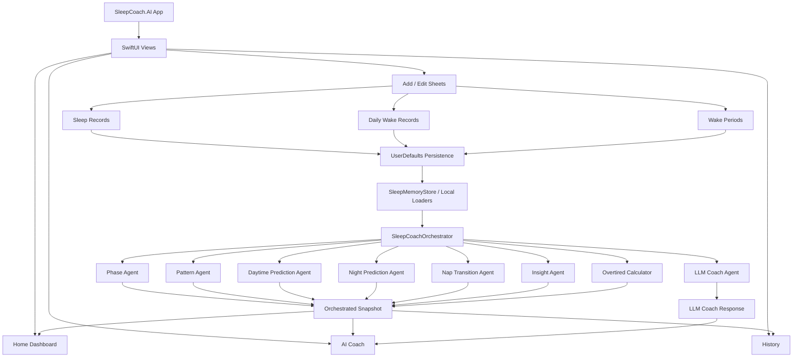
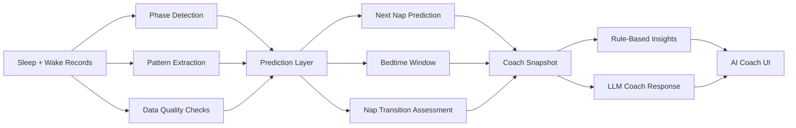
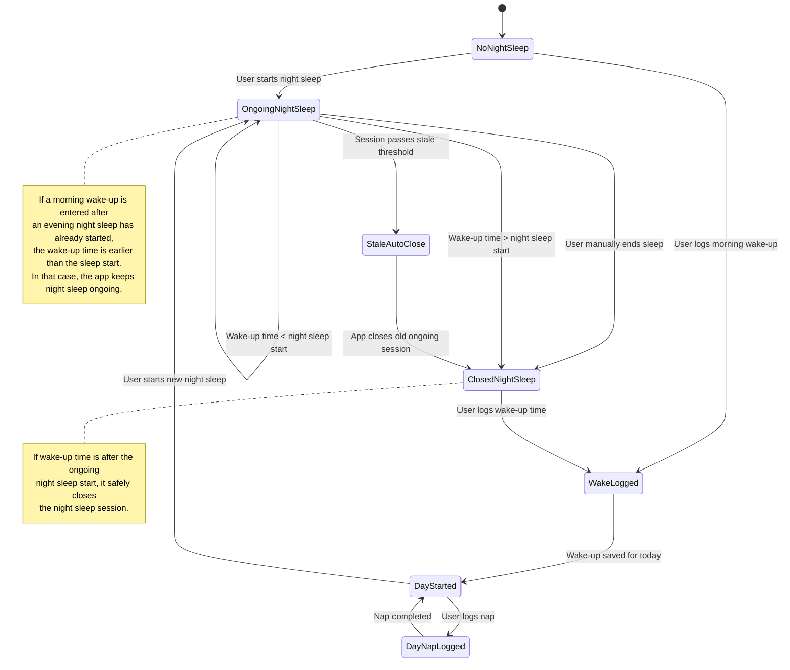
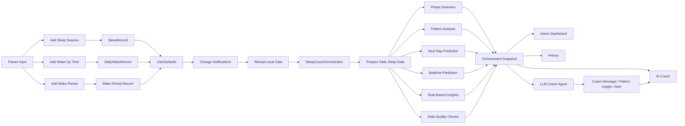
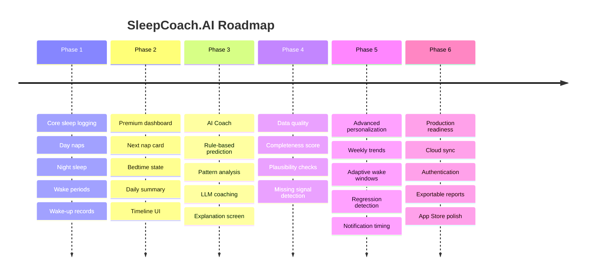

# SleepCoach.AI

SleepCoach.AI is a premium SwiftUI baby sleep tracking app that helps parents log naps, night sleep, wake-up times, and wake periods while receiving AI-assisted sleep predictions and coaching insights.

The app combines a calm daily tracking experience with an agent-based prediction system that learns from a baby's rhythm over time.

---

## Overview

SleepCoach.AI is designed for parents who want a simple but intelligent way to understand their baby's sleep patterns.

The app supports day naps, night sleep, ongoing sleep sessions, wake-up logging, wake periods, daily summaries, bedtime guidance, and an AI Coach experience that explains what to do next and why.

The product goal is to make baby sleep tracking feel clear, calm, and decision-oriented instead of data-heavy.

SleepCoach.AI uses an agent-based prediction architecture where independent components analyze sleep phases, patterns, prediction confidence, and AI coaching before producing a unified recommendation.

---


## Screenshots

<p align="center">
  
  
</p>

---


## Technology Stack

- Swift
- SwiftUI
- MVVM-inspired architecture
- Agent-based prediction architecture
- UserDefaults persistence
- NotificationCenter-based refresh flow
- XCTest
- Google Generative AI Swift SDK

---

## SleepListView Refactoring

`SleepListView` remains the SwiftUI integration point: it owns `@State`, UI lifecycle and callbacks, notification subscriptions, orchestrator generation, sheet presentation, and assignment of calculator/workflow results back into View state.

Focused responsibilities are now separated into `SleepOverviewCalculator` (overview metrics), `SleepTimelineCalculator` (semantic timeline assembly), `SleepStateCalculator` (active and inferred night state), `SleepRecordPersistence` (sleep-record persistence), `DailyWakeRecordPersistence` (daily wake-record persistence), `SleepListSheetRouter` (sheet routing and callback wiring), and `SleepWakeTimeWorkflow` (deterministic wake-time normalization and ongoing-night closure).

`SleepWakeTimeWorkflow` is non-UI and does not depend on SwiftUI, `@State`, `NotificationCenter`, or `SleepCoachOrchestrator`. Persistence keys remain unchanged; these refactors do not migrate storage. See [`docs/architecture/sleep-list-view-refactor.md`](docs/architecture/sleep-list-view-refactor.md) for the current boundaries.

---


## Core Features

- Sleep session logging  
  Track day naps and night sleep with start time, duration, and ongoing state.

- Wake-up tracking  
  Log the baby's actual morning wake-up time to improve daily nap predictions.

- Wake periods  
  Add awake intervals inside naps or night sleep and subtract them from net sleep.

- Smart home dashboard  
  See the next nap, bedtime window, daily rhythm, wake-up status, and sleep summary in one premium dashboard.

- Ongoing sleep support  
  Keep night sleep or naps active until the user ends them or a valid wake-up time closes the session.

- AI Coach  
  Get nap timing, bedtime guidance, pattern insights, confidence levels, and explanation logic.

- History and day detail  
  Review previous days, inspect records, and understand sleep distribution over time.

---

## Architecture Diagram



---


## AI Pipeline



The AI system is intentionally layered:

- Rule-based agents provide deterministic and reliable sleep guidance.
- Pattern analysis personalizes wake windows over time.
- The LLM layer adds natural-language coaching, pattern interpretation, and parent-friendly explanations.
- The UI separates immediate guidance from model logic so the user can understand both what to do and why.


Why not pure AI?

- Sleep prediction affects real-world parenting decisions.

- For that reason, deterministic rule-based prediction is treated as the primary decision engine.

- LLMs are intentionally used only for interpretation and natural-language coaching rather than core prediction logic.

---


## Wake-Up / Night Sleep State Machine



---

## Data Flow



---

## Project Structure

```txt
SleepCoach.AI/
├── Models/
│   ├── SleepRecord.swift
│   ├── SleepKind.swift
│   └── SegmentKind.swift
├── Views/
│   ├── SleepListView.swift
│   ├── SleepListSheetRouter.swift
│   ├── InsightView.swift
│   ├── HistoryView.swift
│   ├── DayDetailView.swift
│   ├── AddRecordView.swift
│   └── AddBreakView.swift
├── ViewModels/
│   ├── AddRecordViewModel.swift
│   ├── SleepListViewModel.swift
│   └── DayDetailViewModel.swift
├── Services/
│   ├── SleepCoachOrchestrator.swift
│   ├── SleepCoachLLMAgent.swift
│   ├── SleepTimelineCalculator.swift
│   ├── SleepOverviewCalculator.swift
│   ├── SleepStateCalculator.swift
│   ├── SleepRecordPersistence.swift
│   ├── DailyWakeRecordPersistence.swift
│   ├── SleepWakeTimeWorkflow.swift
│   ├── SleepAPI.swift
│   └── SleepStore.swift
├── Agents/
│   ├── Implements/
│   └── Protocols/
├── Memory/
│   └── SleepMemoryStore.swift
└── Utils/
    ├── Date+Extensions.swift
    └── TimeFormat.swift
```

---

## Engineering Decisions

- SwiftUI-first interface for fast iteration and reactive state updates.
- Lightweight local persistence using UserDefaults for early product velocity.
- Agent-based sleep intelligence instead of one large prediction service.
- Deterministic rule-based prediction as the foundation, with LLM coaching layered on top.
- Separate wake-up records from sleep records to keep morning anchors explicit.
- Ongoing sleep sessions support live duration calculation without requiring immediate end-time entry.
- AI Coach UI is split into Today and Logic views to keep guidance actionable and transparent.
- Wake-up time can close an ongoing night sleep only when it occurs after the sleep start time.

---

## Testing Strategy

Focused tests exist for the extracted calculator and persistence boundaries, as well as the deterministic `SleepWakeTimeWorkflow`. They use explicit dates/calendars or isolated persistence stores where appropriate and do not rely on reading SwiftUI `@State` from a plain `SleepListView` value. Broader tests also cover models, agents, and orchestration. This README does not claim a particular test-run result.

---

## Challenges

Key engineering challenges in this project:

- Handling ongoing sleep sessions across calendar boundaries.
- Preventing morning wake-up logs from incorrectly closing newly started night sleep sessions.
- Balancing age-based sleep guidance with personalized baby-specific rhythm.
- Keeping AI Coach explanations useful without making the UI feel clinical.
- Designing a premium interface for tired parents who need clarity, not complexity.
- Maintaining predictable state updates across UserDefaults, NotificationCenter, and SwiftUI views.

---

## Roadmap



---

## Future Improvements

- SwiftData or Core Data migration
- iCloud sync
- Push notifications before predicted naps
- Weekly and monthly sleep analytics
- Exportable pediatric sleep reports
- Better test coverage for prediction agents
- App Store-ready onboarding and settings polish

---

## Author

**Büşra Kalay**  
iOS Developer | Swift | SwiftUI | MVVM | AI-assisted mobile products

LinkedIn: https://linkedin.com/in/busrakalay  
GitHub: https://github.com/busrayildiiz

---

## Note

This project is actively evolving as a premium iOS sleep tracking and AI coaching experience.
